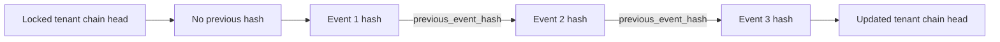

# Talent Intelligence audit foundation

Phase 1 emits these successful mutation events:

- `candidate.created`, `candidate.updated`, `candidate.deletion_requested`
- `job.created`, `job.updated`, `job.published`
- `scoring_policy.created`, `scoring_policy.activated`

Candidate identifiers are tenant-salted SHA-256 pseudonyms. Metadata is recursively checked for banned PII keys, obvious email/phone values, raw CV fields, and encrypted PII fields.

The hash input is stable, sorted canonical JSON containing the previous hash and the event creation timestamp.
`chain_sequence`, protected by append-only database triggers and a tenant uniqueness constraint, defines chain
order; timestamps are not used for runtime ordering.

Append initializes the tenant head with conflict-safe insert semantics, locks it with `SELECT ... FOR UPDATE`,
assigns `last_sequence + 1`, inserts and flushes the event, and advances the head in the same transaction. Different
tenant heads can be locked independently. This covers concurrent first events and established chains across API and
worker processes.

Verification checks a sequence starting at 1, gaps or duplicates, previous hashes, recalculated event hashes, and
the final chain-head state. PostgreSQL and MySQL install `BEFORE UPDATE` and `BEFORE DELETE` rejection triggers while
allowing inserts. This is database-enforced append-only behavior, not immutable storage: a database administrator can
still alter or drop database objects.
