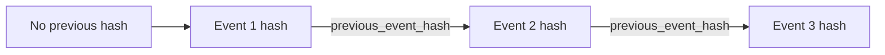

# Talent Intelligence audit foundation

Phase 1 emits these successful mutation events:

- `candidate.created`, `candidate.updated`, `candidate.deletion_requested`
- `job.created`, `job.updated`, `job.published`
- `scoring_policy.created`, `scoring_policy.activated`

Candidate identifiers are tenant-salted SHA-256 pseudonyms. Metadata is recursively checked for banned PII keys, obvious email/phone values, raw CV fields, and encrypted PII fields.

The hash input is stable, sorted canonical JSON containing the previous hash and the event creation timestamp. Verification reads one tenant's events in deterministic `(created_at, id)` order and reports the first invalid event.

The repository intentionally exposes append, list, latest, and chain reads only; there are no controller update/delete routes. Phase 1 does not install database triggers that prohibit privileged direct SQL mutation.

The latest existing row is selected `FOR UPDATE` during append. This serializes established PostgreSQL chains, but simultaneous first events for a previously empty tenant can race because there is no row to lock. A tenant-scoped advisory lock or chain-head table is required before high-volume concurrent production auditing.
