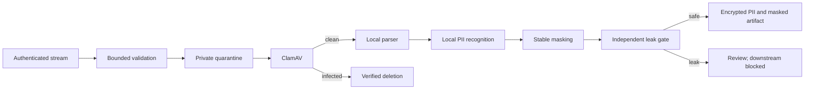

# Secure CV ingestion

Phase 2 accepts authenticated multipart PDF, DOCX, and UTF-8 TXT uploads. It validates bounded size, MIME, signature, archive expansion, and SHA-256 before private quarantine storage. Original filenames are discarded.

Celery receives tenant, document, and correlation identifiers only. Raw bytes and extracted text are never task arguments or database columns.
