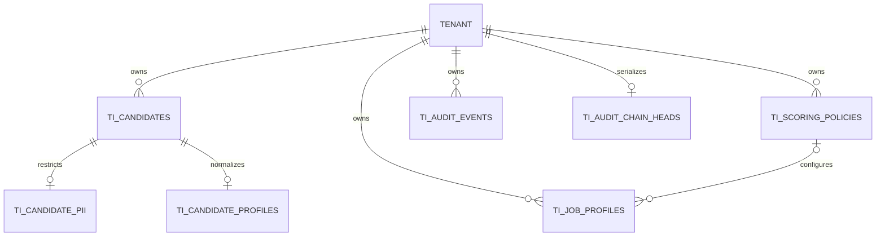
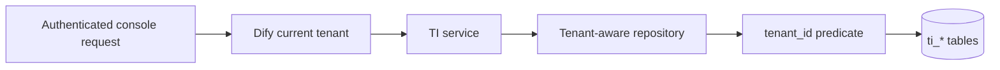

# Talent Intelligence Phase 1 data model

Phase 2 adds `ti_candidate_documents` with a composite tenant-aware candidate foreign key and indexes for tenant/candidate, tenant/status, raw retention, and tenant/SHA-256. Original filenames are never stored. CandidatePII gains an encrypted placeholder map, schema version, safe detection metadata, and source document ID. Lifecycle completion remains derivable, so no redundant candidate columns were added.

All tables use Dify's shared SQLAlchemy metadata, UUID representation, JSON type, and database connection. The `ti_` prefix preserves MySQL/PostgreSQL portability without introducing a PostgreSQL-only schema.

| Model | Data classification | Lifecycle rule |
| --- | --- | --- |
| Candidate | Recruitment metadata; no raw CV or PII | Tenant-scoped external reference, soft deletion |
| CandidatePII | Restricted schema and repository boundary | One row per candidate; no normal API serialization |
| CandidateProfile | Masked and normalized fixture data | One active profile per candidate in Phase 1 |
| JobProfile | Structured job requirements; no generated JD or salary | Draft on creation; dedicated publish transition; published rows immutable |
| ScoringPolicy | Persisted weights and policy configuration; no calculated scores | Database-enforced one active version per tenant and logical name |
| AuditEvent | PII-free mutation evidence | Database-enforced append-only rows with a tamper-evident cryptographic hash chain |
| AuditChainHead | Tenant chain serialization state | One row per tenant; advanced atomically with its AuditEvent |

Candidate and Job repository reads also filter `deleted_at`. A UUID belonging to another tenant therefore produces the same not-found result as an unknown UUID.

Composite foreign keys bind CandidatePII and CandidateProfile to Candidate by `(tenant_id, candidate_id)`, and
JobProfile to ScoringPolicy by `(tenant_id, scoring_policy_id)`. Cross-tenant relationships fail even when SQL
bypasses the service layer. A generated nullable policy-name key enforces one active policy per `(tenant_id, name)`
on PostgreSQL and MySQL without limiting inactive versions.

CandidatePII provides only the restricted schema and repository boundary in Phase 1. Production encryption and
the encrypted PII write flow are deferred to Phase 2.

Phase 1 keeps job version `1` for its full draft lifecycle. Publishing freezes that row. A later edit must be represented by a newly created draft; cloning automation is intentionally deferred.
