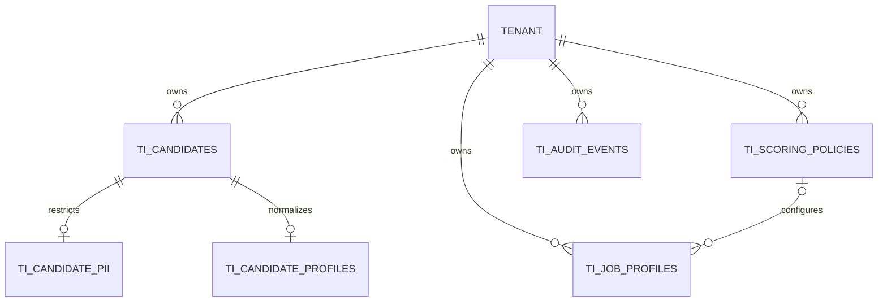
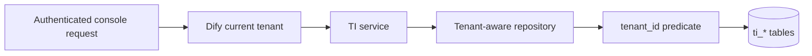

# Talent Intelligence Phase 1 data model

All tables use Dify's shared SQLAlchemy metadata, UUID representation, JSON type, and database connection. The `ti_` prefix preserves MySQL/PostgreSQL portability without introducing a PostgreSQL-only schema.

| Model | Data classification | Lifecycle rule |
| --- | --- | --- |
| Candidate | Recruitment metadata; no raw CV or PII | Tenant-scoped external reference, soft deletion |
| CandidatePII | Restricted encrypted values only | One row per candidate; no normal API serialization |
| CandidateProfile | Masked and normalized fixture data | One active profile per candidate in Phase 1 |
| JobProfile | Structured job requirements; no generated JD or salary | Draft on creation; dedicated publish transition; published rows immutable |
| ScoringPolicy | Persisted weights and policy configuration; no calculated scores | New create for each version; one active version per logical name |
| AuditEvent | PII-free append-only mutation evidence | Application append/read repository only; deterministic hash chain |

Candidate and Job repository reads also filter `deleted_at`. A UUID belonging to another tenant therefore produces the same not-found result as an unknown UUID.

Phase 1 keeps job version `1` for its full draft lifecycle. Publishing freezes that row. A later edit must be represented by a newly created draft; cloning automation is intentionally deferred.
