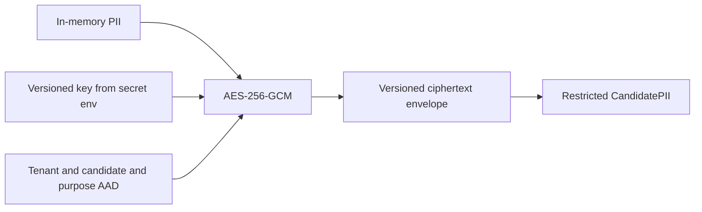

# PII encryption

CandidatePII uses AES-256-GCM with a random 96-bit nonce per value. Authentication data binds tenant ID, candidate ID, purpose, and schema version, so moving ciphertext across boundaries fails authentication.

`TI_PII_ENCRYPTION_KEYS_JSON` maps versions to base64-encoded 32-byte keys; `TI_PII_ACTIVE_KEY_VERSION` selects writes. Real keys must never be committed or logged. There is no public decryption endpoint.
