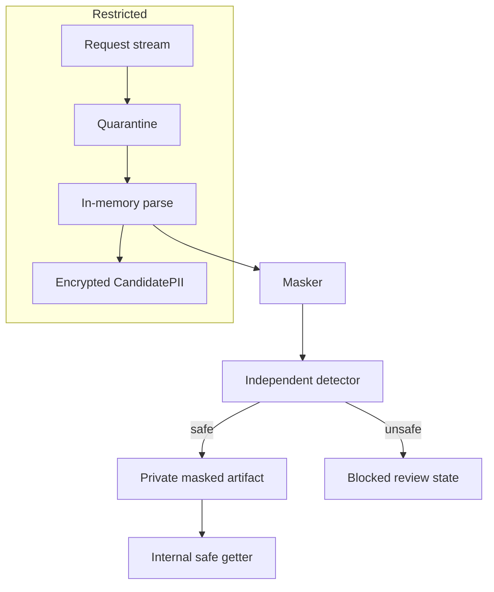

# Privacy boundary

Raw PII may exist only in the multipart stream, bounded upload memory, private quarantine object, in-memory parsed document, and encrypted CandidatePII output. This implementation creates no parser temp files.

Raw PII must never exist in Dify workflows, LLM prompts, Dify Knowledge, CandidateProfile, masked artifacts, Celery messages, audit metadata, ordinary logs, or API responses.

`assert_document_safe_for_downstream` requires a ready or raw-deleted document, no review flag, and a private masked artifact.
